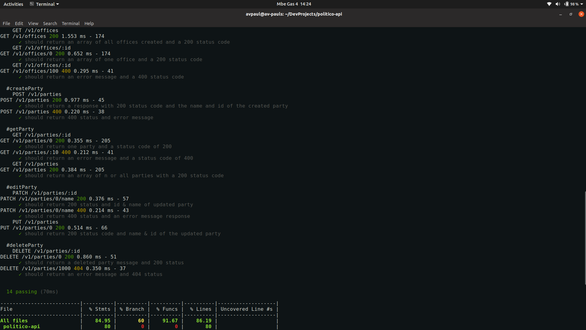

# Politico-api 
 
[](https://coveralls.io/github/avpaul/politico-api?branch=master) 
[](https://codeclimate.com/github/avpaul/politico-api/maintainability) 
[](https://opensource.org/licenses/MIT)

<p align="center">
  <a href="https://peoplevote.herokuapp.com/">
    
  </a>
</p>

We are used to _*ballot box elections*_ and the whole process it takes until we get election results.
Polling places, ballot box, ballot paper, counting votes and so on can be expensive and tedious.
Technology especially internet powers many things nowadays from booking your next vacation ticket 
to doing business across the five continents from home! It's time to take our elections online :computer: :+1:

>The ballot box election is the traditional form of voting 
>which takes place directly at the polling place.

*Politico* is a digital voting system which make use of internet to allow people to vote in an 
election and have there votes counted online.

Politico-API creates API end points for the [Politico app.](http://avpaul.github.io/politico) It the second challenge for the Andela 
pre-bootcamp project in cycle 3 Rwanda.

### Framework and Technologies used
*Built with*
* [Nodejs](https://www.nodejs.org)
* [Expressjs](https://www.expressjs.com)

*API end-points tested by*
* [Mocha](https://www.mochajs.org)
* [Postman](https://www.getpostman.com)

*Continuous Integration and test coverage by*
* [Travis Ci](https://www.travis-ci.org) for CI
* [Coveralls](https://www.coveralls.io) for test coverage

### Installation
Clone this repo locally and install dependencies
```
$ git clone https://github.com/avpaul/politico-api.git 
$ cd ./politico-api
$ npm install
```
To start the application run `npm start` or use [Nodemon](https://www.nodemon.io) for restarting server on save.

### Tests
```
$ npm test
```



### License
MIT &COPY; [avpaul](https://www.github.com/avpaul)
